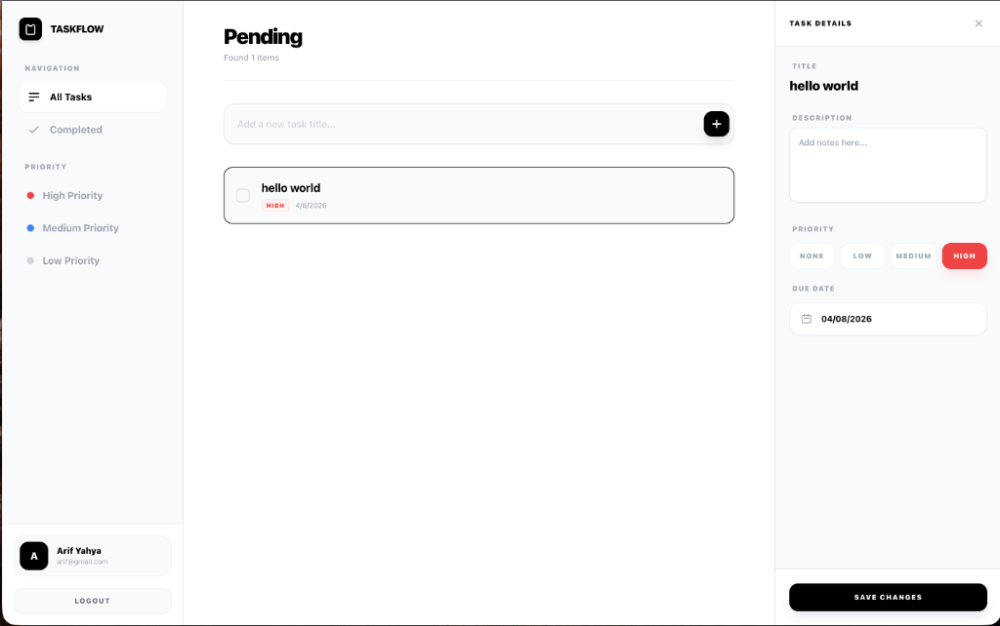

# 🚀 TaskFlow: Premium Todo App

A high-performance, minimalist Todo application built with **Go (Gin)** and **Vue 3 (Vite)**. Designed with a premium monochrome aesthetic and a master-detail workflow.



## ✨ Key Features

- **Master-Detail Interface**: Create tasks instantly by title and edit details (description, due date, priority) in a sleek side-pane.
- **Priority Management**: Color-coded task priorities (High, Medium, Low) with a modern segmented selector.
- **Premium Datepicker**: Integrated `V-Calendar` for a smooth, interactive date selection experience.
- **Smart Filtering**: Automatic sorting for pending tasks, with a dedicated menu for completed items.
- **Monochrome Aesthetics**: High-contrast Black & White design with smooth micro-animations and glassmorphism touches.
- **Toast Notifications**: Real-time feedback for every action (success/error) with soft emerald/red styling.
- **Responsive Design**: Fluid layout that adapts between Mobile, iPad, and Desktop (side-by-side view).
- **Authentication**: Secure JWT-based login and registration system.

## 🛠 Tech Stack

### Backend
- **Language**: Go 1.22
- **Framework**: Gin Gonic
- **Database**: PostgreSQL (GORM)
- **Security**: JWT Authentication, CORS Middleware

### Frontend
- **Framework**: Vue 3 (Composition API)
- **State Management**: Pinia
- **Styling**: Vanilla CSS / Tailwind (for layout)
- **Components**: V-Calendar (Datepicker), Axios (API)
- **Tooling**: Vite

## 🚀 Getting Started

1. **Clone the repository**
2. **Setup Environment**:
   ```bash
   cp .env.example .env
   ```
3. **Launch with Docker**:
   ```bash
   docker-compose up -d --build
   ```

## 📍 Services & Ports

- **Frontend**: [http://localhost:5174](http://localhost:5174)
- **Backend API**: [http://localhost:8081](http://localhost:8081)
- **Database**: `localhost:5432` (PostgreSQL)

---

## 🏗 Project Structure

- `/backend`: Go source code & Handlers.
- `/frontend`: Vue 3 components, stores, and assets.
- `/screenshots`: UI/UX snapshots.
- `/.planning`: Technical implementation plans & task history.

---
Designed with ❤️ by **TaskFlow Team**.
